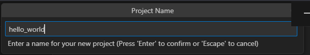
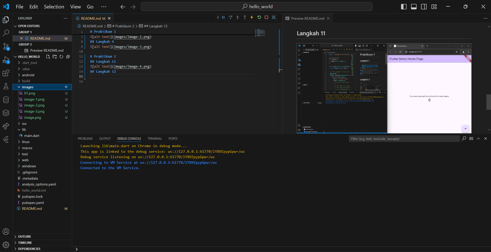
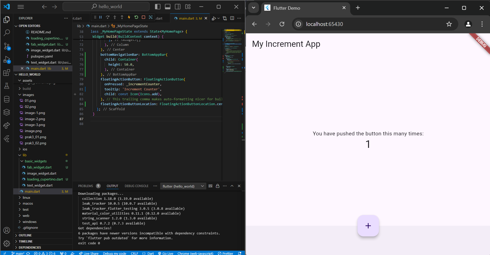

Nama    : Putri Ayu Aliciawati      
Kelas   : TI-3C     
NIM     : 2241720132        

# Praktikum 1
## Langkah 1     
   
Pertama, membuat proyek baru dengan memilih "Application". Flutter akan membuat folder dan file yang diperlukan secara otomatis.   
## Langkah 2
        
Pilih folder untuk penyimpanan proyek.
## Langkah 3        
        
Memberi nama proyek.
## Langkah 4        
     
Proyek flutter siap dijalankan.

# Praktikum 2
## Langkah 11
      
Menjalankan aplikasi dengan menggunakan chrome.
## Langkah 12       
      
Membuat laporan di file README dan menambahkan screenshot hasil praktikum.

# Praktikum 3       
## Langkah 1        
        
Kode tersebut adalah sebuah widget bernama MyTextWidget, yang merupakan turunan dari StatelessWidget.Sebagai widget stateless, MyTextWidget tidak menyimpan atau merespons perubahan keadaan, sehingga tampilannya bersifat statis.
## Langkah 2        
        
Widget ini bertujuan untuk menampilkan sebuah gambar menggunakan library Material Flutter. Penggunaan kata kunci const pada widget Image menunjukkan bahwa gambar ini bersifat statis dan tidak berubah selama aplikasi berjalan. Untuk memastikan gambar ditampilkan dengan benar, file "logo_polinema.jpg" harus ditambahkan ke direktori aset di aplikasi Flutter dan direferensikan dalam file pubspec.yaml.

# Praktikum 4
## Langkah 1, 2, 3
        
Pada langkah 1, kode tersebut mendefinisikan widget LoadingCupertino. Kemudian pada langkah 2 mendefinisikan sebuah widget bernama FabWidget yang menggunakan Material Design dari Flutter untuk menampilkan Floating Action Button (FAB). Scaffold widget digunakan untuk mengatur tata letak sesuai dengan material design.
## Langkah 4        
.png)      
.png)      
Pada langkah ke 4 ditampilkan sebuah button untuk memunculkan alert. Dialog widget pada flutter memiliki dua jenis dialog yaitu AlertDialog dan SimpleDialog.
## Langkah 5        
.png)      
.png)      
Pada langkah 5 ini memberikan contoh penggunaan input pada flutter. Di langkah ini digunakan input berupa TextField.
## Langkah 6        
.png)      
.png)        
.png)      
Selain TextField, flutter juga menyediakan input dan selection widget berupa Date and Time Pickers.
