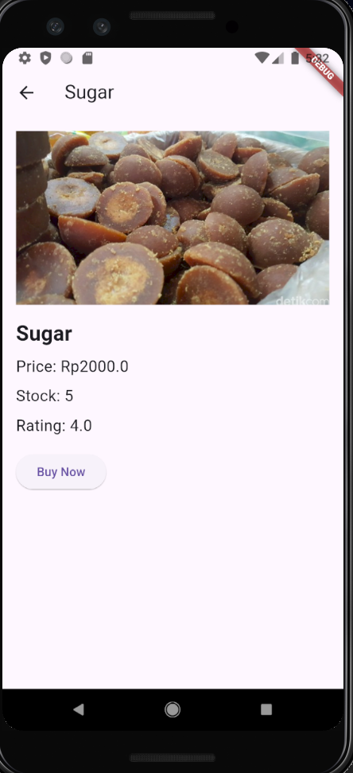

Nama : Putri Ayu Aliciawati
Kelas : TI-3C
NIM : 2241720132

# Praktikum 5
## Langkah 1  
.png)  
Membuat proyek baru bernama "belanja"    
.png)

## Langkah 2
Pada home_page.dart :  
.png)  
Pada item_page.dart :  
.png)  

## Langkah 3  
.png)   
Definisi penamaan route harus bersifat unique. Halaman HomePage didefinisikan sebagai /. Dan halaman ItemPage didefinisikan sebagai /item.

## Langkah 4  
.png)  
Sebelum melakukan perpindahan halaman dari HomePage ke ItemPage, dibutuhkan proses pemodelan data. Pada desain mockup, dibutuhkan dua informasi yaitu nama dan harga.

## Langkah 5
.png)  
Pada halaman HomePage terdapat ListView widget. Sumber data ListView diambil dari model List dari object Item. 

## Langkah 6  
Kode :  
.png)
Hasil running :  
.png)    
Item pada ListView saat ini ketika ditekan masih belum memberikan aksi tertentu. 

## Langkah 7  
.png)  
Hasil running :  
.png)  
Ketika di klik akan berpindah ke halaman Item Detail.  

# Tugas Praktikum 2  
1. `Navigator.pushNamed(context, '/item', arguments: item);`   Baris kode Navigator.pushNamed(context, '/item', arguments: item); digunakan untuk menavigasi dari satu halaman ke halaman lain dalam aplikasi Flutter menggunakan named route. Fungsi ini mengambil tiga argumen: context, yang merujuk pada konteks widget saat ini; '/item', yang merupakan identifikasi untuk halaman tujuan (dalam hal ini, ItemPage); dan arguments: item, yang mengirimkan objek item sebagai data tambahan ke halaman yang dituju.

2. `final Item item = ModalRoute.of(context)!.settings.arguments as Item;` Pembacaan nilai yang dikirimkan pada halaman sebelumnya dapat dilakukan menggunakan ModalRoute.

3. Menambah foto, stok, dan rating :  
  

4. Home page :  
.png)  
Item Page :  
.png)   
Hasil running :  

5. Hasil modifikasi :  
.png)    
.png)  
Saya membagi menjadi 2 file widget terpisah yaitu :  
Footer  
.png)  
itemCard  
.png)
