Nama : Putri Ayu Aliciawati  
Kelas : TI-3C   
NIM : 2241720132  

# Praktikum 1 : Mengunduh Data dari Web Service (API)  
## Langkah 1
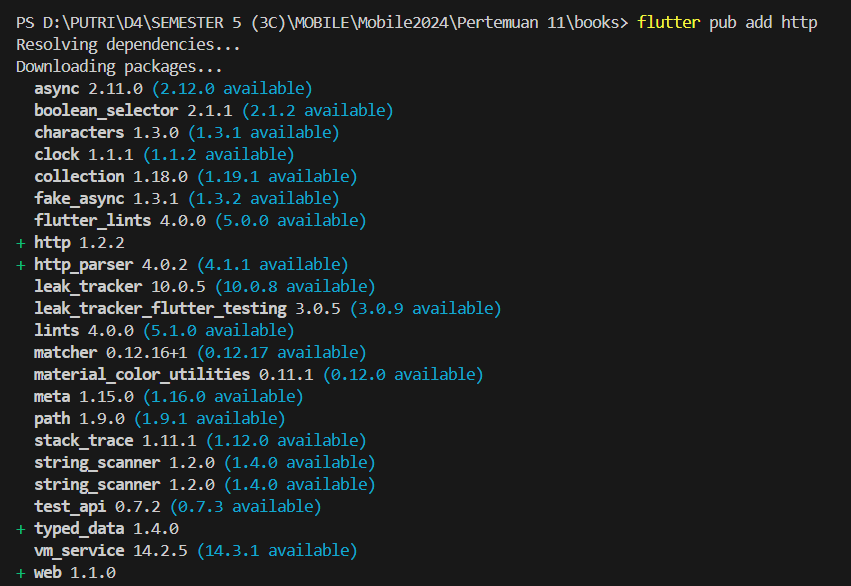
## Langkah 2  
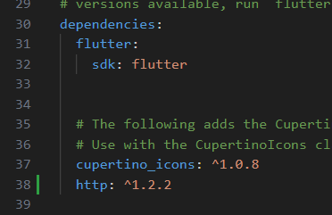  
## Langkah 3  
### Soal 1  
Tambahkan nama panggilan Anda pada title app sebagai identitas hasil pekerjaan Anda.
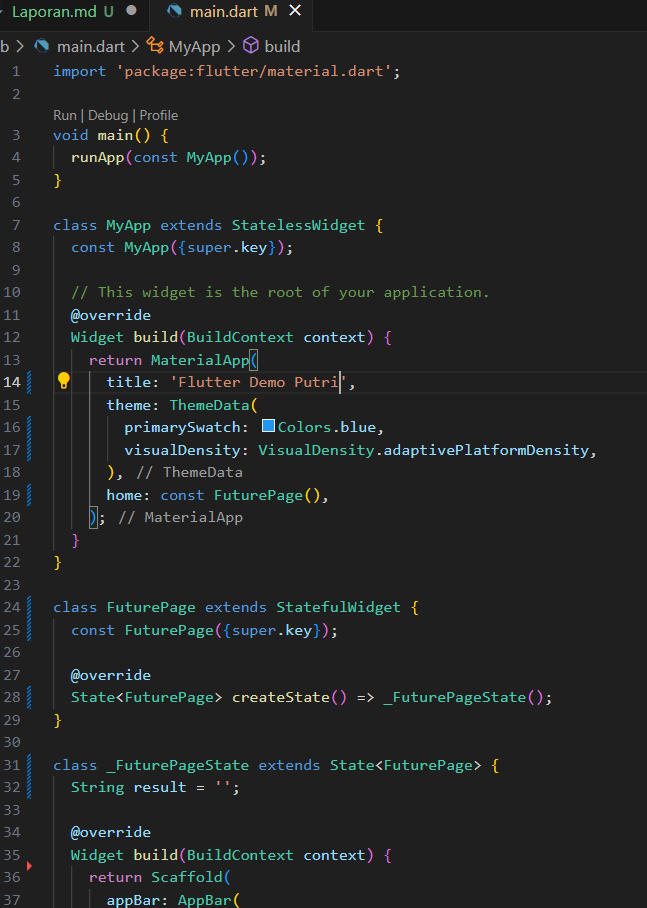  
## Langkah 4  
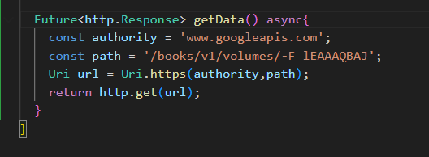
### Soal 2  
Carilah judul buku favorit Anda di Google Books, lalu ganti ID buku pada variabel path di kode tersebut. Caranya ambil di URL browser Anda seperti gambar berikut ini. Kemudian cobalah akses di browser URI tersebut dengan lengkap seperti ini. Jika menampilkan data JSON, maka Anda telah berhasil. Lakukan capture milik Anda dan tulis di README pada laporan praktikum. Lalu lakukan commit dengan pesan "W12: Soal 2".  
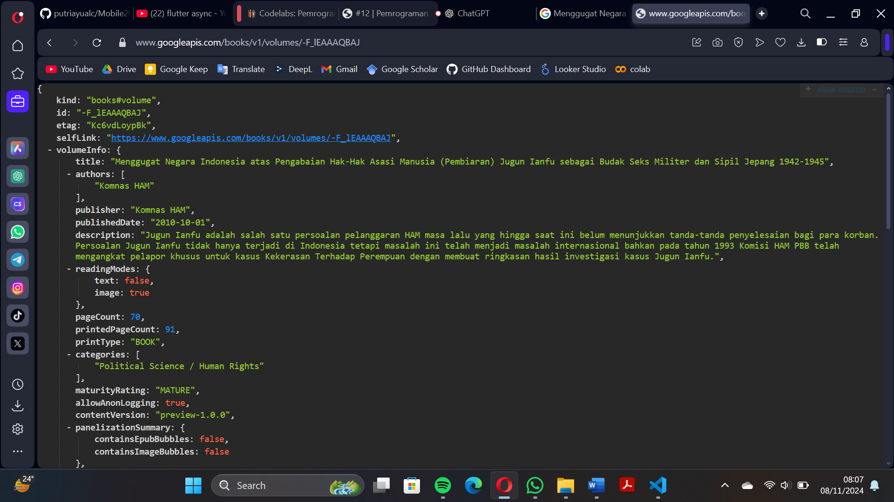  
## Langkah 5  
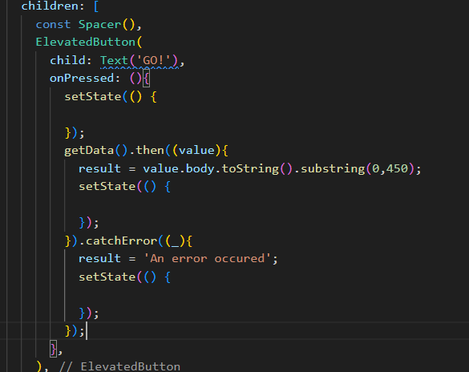
### Soal 3
- Jelaskan maksud kode langkah 5 tersebut terkait substring dan catchError!  
    1. **substring(0, 450)**: Potongan kode ini digunakan untuk mengambil substring dari hasil `value.body`. Dengan menggunakan metode `substring(0, 450)`, bagian string yang diambil adalah dari indeks ke-0 hingga ke-449, yang artinya hanya menampilkan 450 karakter pertama dari `value.body`. Ini berguna jika string yang diambil sangat panjang dan ingin disederhanakan atau dibatasi.
    2. **catchError**: Bagian ini adalah penanganan kesalahan (error handling). Jika terjadi kesalahan saat menunggu hasil dari pemanggilan `getData()`, fungsi `catchError` akan dipanggil. Kesalahan tersebut akan menyebabkan `result` diatur ke pesan "An error occured". Kemudian, `setState()` dipanggil untuk memperbarui UI dengan pesan error tersebut.
- Capture hasil praktikum Anda berupa GIF dan lampirkan di README. Lalu lakukan commit dengan pesan "W12: Soal 3".  

# Praktikum 2 : Menggunakan await/async untuk menghindari callbacks 
## Langkah 1  
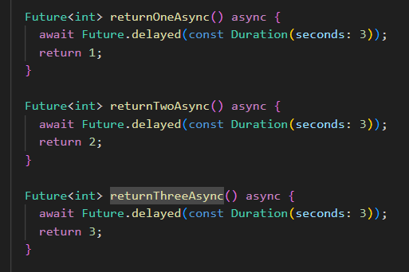
## Langkah 2  
  
## Langkah 3  
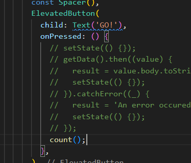  
## Langkah 4  
### Soal 4
- Jelaskan maksud kode langkah 1 dan 2 tersebut!  
Fungsi `count()` adalah fungsi asinkron yang menghitung total angka dengan memanggil tiga fungsi asinkron secara berurutan, masing-masing menunggu selama 3 detik sebelum mengembalikan angka 1, 2, dan 3. Setelah menunggu dan menambahkan hasil dari ketiga fungsi tersebut, total dihitung menjadi 6. Kemudian, `setState()` dipanggil untuk memperbarui variabel `result` dan memperbarui UI. Proses ini membutuhkan total waktu tunggu sekitar 9 detik.
- Capture hasil praktikum Anda berupa GIF dan lampirkan di README. Lalu lakukan commit dengan pesan "W12: Soal 4".  
  

# Praktikum 3 : Menggunakan Completer di Future 
## Langkah 1
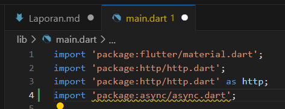
## Langkah 2  
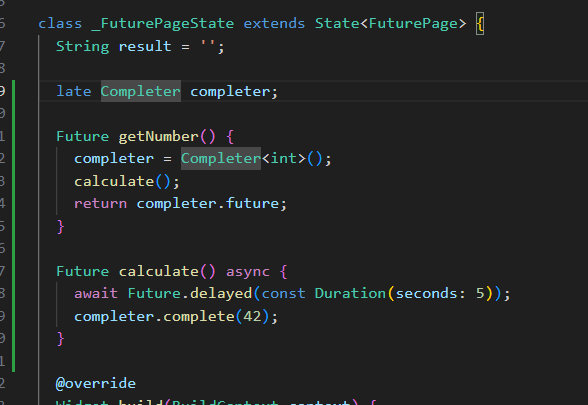
## Langkah 3  
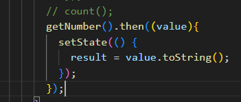
## Langkah 4  
### Soal 5  
- Jelaskan maksud kode langkah 2 tersebut!  
Pada **langkah 2**, kode `completer = Completer<int>();` mendefinisikan sebuah objek `Completer` dengan tipe data `int`. Objek ini bertindak sebagai pengendali untuk menyelesaikan (complete) atau membatalkan sebuah `Future`. `Completer` memungkinkan pembuatan `Future` yang dapat dikontrol secara manual, di mana hasil `Future` tersebut akan diselesaikan menggunakan metode `complete`.
- Capture hasil praktikum Anda berupa GIF dan lampirkan di README. Lalu lakukan commit dengan pesan "W12: Soal 5".  
  
## Langkah 5  
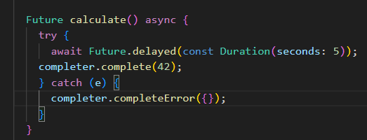  
## Langkah 6  
### Soal 6
- Jelaskan maksud perbedaan kode langkah 2 dengan langkah 5-6 tersebut!  
Langkah 2 menginisialisasi objek `Completer` untuk mengontrol hasil `Future`, sementara langkah 5-6 melibatkan penyelesaian `Future` dan penanganan hasilnya. Di langkah 5, fungsi `calculate()` menyelesaikan `Future` dengan nilai 42 setelah penundaan 5 detik atau menangkap error dan menyelesaikannya dengan `completeError`. Langkah 6 menggunakan `then` untuk memperbarui UI dengan hasil jika berhasil, atau `catchError` untuk menangani dan menampilkan pesan error jika terjadi kesalahan.
- Capture hasil praktikum Anda berupa GIF dan lampirkan di README. Lalu lakukan commit dengan pesan "W12: Soal 6".
