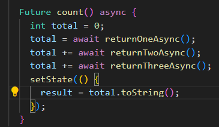
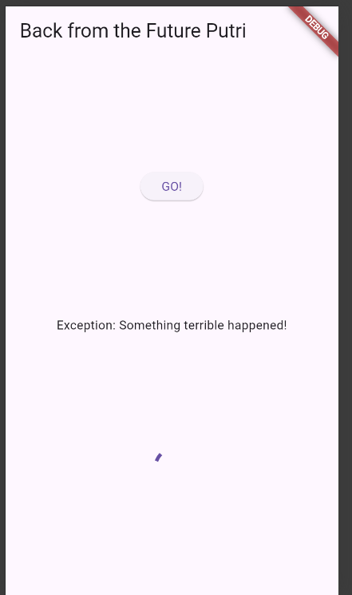
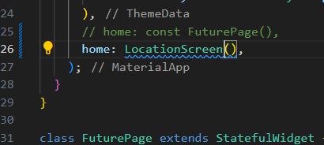
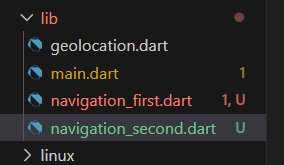

Nama : Putri Ayu Aliciawati  
Kelas : TI-3C   
NIM : 2241720132  

# Praktikum 1 : Mengunduh Data dari Web Service (API)  
## Langkah 1

## Langkah 2  
  
## Langkah 3  
### Soal 1  
Tambahkan nama panggilan Anda pada title app sebagai identitas hasil pekerjaan Anda.
  
## Langkah 4  

### Soal 2  
Carilah judul buku favorit Anda di Google Books, lalu ganti ID buku pada variabel path di kode tersebut. Caranya ambil di URL browser Anda seperti gambar berikut ini. Kemudian cobalah akses di browser URI tersebut dengan lengkap seperti ini. Jika menampilkan data JSON, maka Anda telah berhasil. Lakukan capture milik Anda dan tulis di README pada laporan praktikum. Lalu lakukan commit dengan pesan "W12: Soal 2".  
  
## Langkah 5  

### Soal 3
- Jelaskan maksud kode langkah 5 tersebut terkait substring dan catchError!  
    1. **substring(0, 450)**: Potongan kode ini digunakan untuk mengambil substring dari hasil `value.body`. Dengan menggunakan metode `substring(0, 450)`, bagian string yang diambil adalah dari indeks ke-0 hingga ke-449, yang artinya hanya menampilkan 450 karakter pertama dari `value.body`. Ini berguna jika string yang diambil sangat panjang dan ingin disederhanakan atau dibatasi.
    2. **catchError**: Bagian ini adalah penanganan kesalahan (error handling). Jika terjadi kesalahan saat menunggu hasil dari pemanggilan `getData()`, fungsi `catchError` akan dipanggil. Kesalahan tersebut akan menyebabkan `result` diatur ke pesan "An error occured". Kemudian, `setState()` dipanggil untuk memperbarui UI dengan pesan error tersebut.
- Capture hasil praktikum Anda berupa GIF dan lampirkan di README. Lalu lakukan commit dengan pesan "W12: Soal 3".  

# Praktikum 2 : Menggunakan await/async untuk menghindari callbacks 
## Langkah 1  

## Langkah 2  
  
## Langkah 3  
  
## Langkah 4  
### Soal 4
- Jelaskan maksud kode langkah 1 dan 2 tersebut!  
Fungsi `count()` adalah fungsi asinkron yang menghitung total angka dengan memanggil tiga fungsi asinkron secara berurutan, masing-masing menunggu selama 3 detik sebelum mengembalikan angka 1, 2, dan 3. Setelah menunggu dan menambahkan hasil dari ketiga fungsi tersebut, total dihitung menjadi 6. Kemudian, `setState()` dipanggil untuk memperbarui variabel `result` dan memperbarui UI. Proses ini membutuhkan total waktu tunggu sekitar 9 detik.
- Capture hasil praktikum Anda berupa GIF dan lampirkan di README. Lalu lakukan commit dengan pesan "W12: Soal 4".  
  

# Praktikum 3 : Menggunakan Completer di Future 
## Langkah 1

## Langkah 2  

## Langkah 3  

## Langkah 4  
### Soal 5  
- Jelaskan maksud kode langkah 2 tersebut!  
Pada **langkah 2**, kode `completer = Completer<int>();` mendefinisikan sebuah objek `Completer` dengan tipe data `int`. Objek ini bertindak sebagai pengendali untuk menyelesaikan (complete) atau membatalkan sebuah `Future`. `Completer` memungkinkan pembuatan `Future` yang dapat dikontrol secara manual, di mana hasil `Future` tersebut akan diselesaikan menggunakan metode `complete`.
- Capture hasil praktikum Anda berupa GIF dan lampirkan di README. Lalu lakukan commit dengan pesan "W12: Soal 5".  
  
## Langkah 5  
  
## Langkah 6  
### Soal 6
- Jelaskan maksud perbedaan kode langkah 2 dengan langkah 5-6 tersebut!  
Langkah 2 menginisialisasi objek `Completer` untuk mengontrol hasil `Future`, sementara langkah 5-6 melibatkan penyelesaian `Future` dan penanganan hasilnya. Di langkah 5, fungsi `calculate()` menyelesaikan `Future` dengan nilai 42 setelah penundaan 5 detik atau menangkap error dan menyelesaikannya dengan `completeError`. Langkah 6 menggunakan `then` untuk memperbarui UI dengan hasil jika berhasil, atau `catchError` untuk menangani dan menampilkan pesan error jika terjadi kesalahan.
- Capture hasil praktikum Anda berupa GIF dan lampirkan di README. Lalu lakukan commit dengan pesan "W12: Soal 6".
  

# Praktikum 4 : Memanggil Future secara paralel  
## Langkah 1  

## Langkah 2

## Langkah 3
### Soal 7
Capture hasil praktikum Anda berupa GIF dan lampirkan di README. Lalu lakukan commit dengan pesan "W12: Soal 7".  
  
## Langkah 4  

### Soal 8
Jelaskan maksud perbedaan kode langkah 1 dan 4!  
Perbedaan antara **langkah 1** dan **langkah 4** terletak pada pendekatan yang digunakan untuk menunggu beberapa `Future` selesai secara paralel:

- **Langkah 1 (FutureGroup)**: Menggunakan `FutureGroup` dari paket `async` untuk mengelompokkan dan mengelola beberapa `Future`. Anda menambahkan setiap `Future` ke dalam `FutureGroup`, menutup grup, dan menunggu semua `Future` selesai sebelum memproses hasilnya. Pendekatan ini berguna jika Anda ingin memiliki kontrol lebih dalam mengelola `Future` sebelum menutup grup.

- **Langkah 4 (Future.wait)**: Menggunakan `Future.wait`, sebuah metode bawaan dalam Dart yang menjalankan semua `Future` dalam daftar secara paralel dan menghasilkan hasilnya dalam daftar setelah semuanya selesai. Ini adalah pendekatan yang lebih sederhana dan lebih langsung untuk menunggu beberapa `Future` secara bersamaan.  

# Praktikum 5 : Menangani Respon Error pada Async Code  
## Langkah 1  

## Langkah 2

## Langkah 3  
  

### Soal 9  
Capture hasil praktikum Anda berupa GIF dan lampirkan di README. Lalu lakukan commit dengan pesan "W12: Soal 9".  
   
## Langkah 4  
  
### Soal 10  
Panggil method handleError() tersebut di ElevatedButton, lalu run. Apa hasilnya? Jelaskan perbedaan kode langkah 1 dan 4!  
  
Pendekatan pertama menggunakan *callback chaining* dengan `then`, `catchError`, dan `whenComplete`, yang dapat membuat kode *asynchronous* lebih kompleks dan sulit dibaca. Sebaliknya, pendekatan kedua dengan `async/await` menyederhanakan pengelolaan *future* dan menjadikannya lebih mudah dibaca, menyerupai kode sinkron. Saat tombol ditekan dan `handleError()` dijalankan, kesalahan dari `returnError()` akan ditangani dalam blok `catch`, dan "Complete" akan tetap dicetak, terlepas dari hasilnya. Pendekatan `async/await` umumnya lebih direkomendasikan untuk kejelasan kode.  

# Praktikum 6 : Menggunakan Future dengan StatefulWidget  
## Langkah 1  
  
## Langkah 2  
  
## Langkah 3  
  
## Langkah 4  

## Langkah 5  
### Soal 11 
Tambahkan nama panggilan Anda pada tiap properti title sebagai identitas pekerjaan Anda.
  
## Langkah 6  
  
## Langkah 7  

## Langkah 8  

### Soal 12  
- Jika Anda tidak melihat animasi loading tampil, kemungkinan itu berjalan sangat cepat. Tambahkan delay pada method getPosition() dengan kode await Future.delayed(const Duration(seconds: 3));
- Apakah Anda mendapatkan koordinat GPS ketika run di browser? Mengapa demikian?  
Disini saya mendapatkan koordinat GPS meskipun di run di browser.  

Namun ada kemungkinan tidak akan mendapatkan koordinat GPS yang valid ketika menjalankan aplikasi ini di browser. Ini karena plugin geolocator memiliki keterbatasan pada platform web. Untuk mendapatkan koordinat GPS yang valid, sebaiknya menjalankan aplikasi di perangkat fisik seperti ponsel atau tablet.  
- Capture hasil praktikum Anda berupa GIF dan lampirkan di README. Lalu lakukan commit dengan pesan "W11: Soal 12".  

# Praktikum 7: Manajemen Future dengan FutureBuilder  
## Langkah 1  

## Langkah 2  

## Langkah 3  

## Langkah 4

### Soal 13
- Apakah ada perbedaan UI dengan praktikum sebelumnya? Mengapa demikian?  
Perbedaannya adalah dengan `FutureBuilder`, UI secara otomatis diperbarui berdasarkan status *future*, menampilkan `CircularProgressIndicator` saat data masih dimuat dan koordinat setelahnya. Ini membuat kode lebih bersih dan responsif dibandingkan dengan pendekatan sebelumnya yang memerlukan pembaruan manual menggunakan `setState`.
- Capture hasil praktikum Anda berupa GIF dan lampirkan di README. Lalu lakukan commit dengan pesan "W11: Soal 13".  

- Seperti yang Anda lihat, menggunakan FutureBuilder lebih efisien, clean, dan reactive dengan Future bersama UI.  
## Langkah 5  

### Soal 14  
- Apakah ada perbedaan UI dengan langkah sebelumnya? Mengapa demikian?  
Jika terjadi kesalahan saat mencoba mendapatkan data lokasi (misalnya, jika izin ditolak atau layanan lokasi tidak tersedia), UI sekarang akan menampilkan pesan "Something terrible happened!" sebagai ganti dari hanya menampilkan teks kosong. Sebelumnya, jika ada kesalahan, UI tidak menampilkan pesan yang menjelaskan apa yang salah.
- Capture hasil praktikum Anda berupa GIF dan lampirkan di README. Lalu lakukan commit dengan pesan "W11: Soal 14".  
 

# Praktikum 8: Navigation route dengan Future Function  
## Langkah 1  

## Langkah 2  
### Soal 15
- Tambahkan nama panggilan Anda pada tiap properti title sebagai identitas pekerjaan Anda.
- Silakan ganti dengan warna tema favorit Anda.  

## Langkah 3  
  
## Langkah 4  

## Langkah 5

## Langkah 6

## Langkah 8  

### Soal 16  
- Cobalah klik setiap button, apa yang terjadi ? Mengapa demikian ?  
Ketika mengklik tombol "Change Color" di NavigationFirst, layar NavigationSecond akan terbuka. Setelah memilih warna di NavigationSecond, maka akan kembali ke NavigationFirst dengan latar belakang yang diperbarui sesuai dengan warna yang dipilih.
Ketika mengklik tombol `red`, `green`, `blue`, warna yang dipilih (merah, hijau, atau biru) dikirim kembali ke layar sebelumnya, dan layar `NavigationSecond` ditutup. Ini terjadi karena `Navigator.pop(context, color)` menutup layar saat ini dan mengembalikan warna yang dipilih ke layar pemanggil.
- Gantilah 3 warna pada langkah 5 dengan warna favorit Anda!  

- Capture hasil praktikum Anda berupa GIF dan lampirkan di README. Lalu lakukan commit dengan pesan "W11: Soal 16".  
