Nama : Putri Ayu Aliciawati  
Kelas : TI-3C  
NIM : 2241720132  

# Praktikum 7  
## Langkah 1  
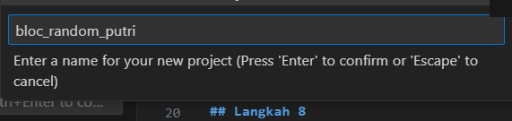
## Langkah 2
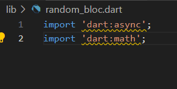
## Langkah 3  

## Langkah 4
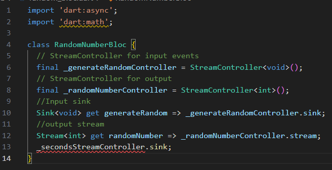
## Langkah 5
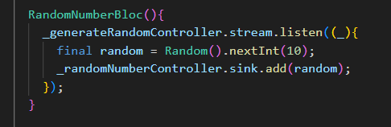
## Langkah 6
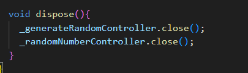
## Langkah 7  
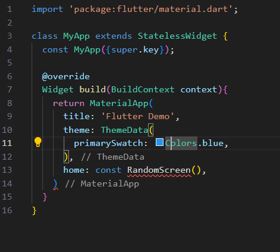
## Langkah 8
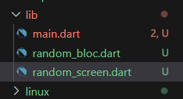
## Langkah 9
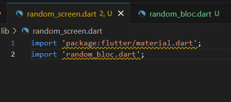
## Langkah 10
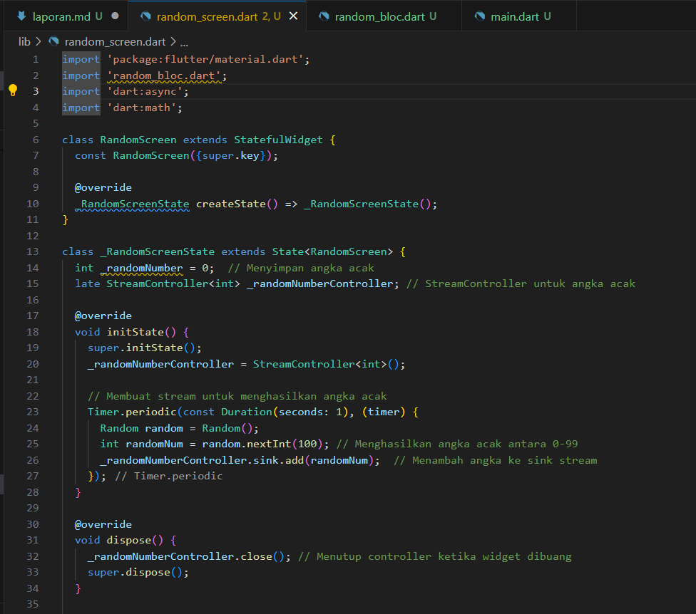
## Langkah 11
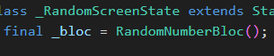
## Langkah 12
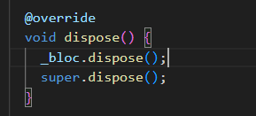
## Langkah 13
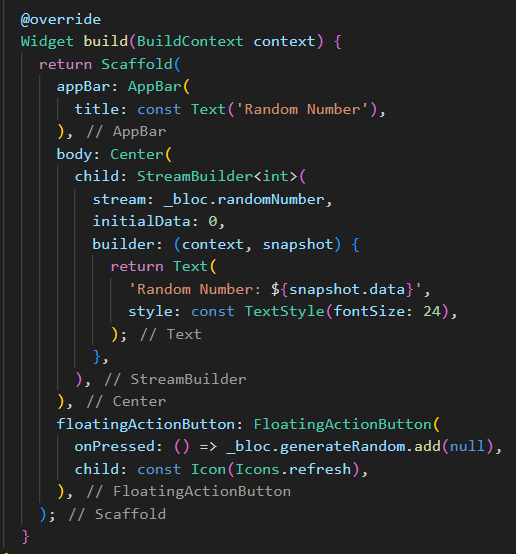
### Soal 13
- Jelaskan maksud praktikum ini ! Dimanakah letak konsep pola BLoC-nya ?
    Praktikum ini bertujuan untuk memahami dan mengimplementasikan pola arsitektur BLoC (Business Logic Component) dalam Flutter, yang memisahkan logika bisnis dari antarmuka pengguna (UI) menggunakan *stream*. Logika bisnis dikelola di kelas `RandomNumberBloc`, di mana *StreamController* menerima *event* melalui `generateRandom` untuk menghasilkan angka acak dan mengirimkannya ke *stream* `randomNumber`. UI, yang dikelola oleh widget `RandomScreen`, menggunakan `StreamBuilder` untuk berlangganan ke *stream* tersebut, sehingga setiap data baru secara otomatis memperbarui tampilan. Tombol di aplikasi memicu *event* melalui *sink*, memanfaatkan pendekatan berbasis *event-driven*. Pola ini mendukung pemisahan logika dan UI, meningkatkan reusabilitas, testabilitas, dan skalabilitas aplikasi.
- Capture hasil praktikum Anda berupa GIF dan lampirkan di README.
    
- Lalu lakukan commit dengan pesan "W13: Jawaban Soal 13".