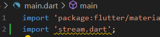
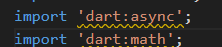
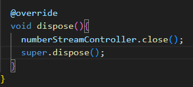

Nama  : Putri Ayu Aliciawati  
Kelas : TI-3C  
NIM   : 2241720132  

# Praktikum 1  
## Langkah 1
  
## Langkah 2

### Soal 1  
- Tambahkan nama panggilan Anda pada title app sebagai identitas hasil pekerjaan Anda.  

- Gantilah warna tema aplikasi sesuai kesukaan Anda.  

- Lakukan commit hasil jawaban Soal 1 dengan pesan "W13: Jawaban Soal 1"  
## Langkah 3  
  
## Langkah 4  
  
### Soal 2  
- Tambahkan 5 warna lainnya sesuai keinginan Anda pada variabel colors tersebut.

- Lakukan commit hasil jawaban Soal 2 dengan pesan "W13: Jawaban Soal 2"  
## Langkah 5  

## Langkah 6  
  
### Soal 3
- Jelaskan fungsi keyword yield* pada kode tersebut!  
Keyword `yield*` dalam kode tersebut digunakan untuk menyalurkan atau mendelegasikan semua elemen dari `Stream` lain ke `Stream` yang sedang didefinisikan. Dalam konteks ini, `yield* Stream.periodic(...)` memungkinkan semua elemen yang dihasilkan oleh `Stream.periodic`, yang menghasilkan elemen setiap satu detik, untuk diteruskan secara langsung ke `Stream` dari fungsi `getColors`. Ini memastikan bahwa warna-warna dari daftar `colors` dipancarkan secara berurutan dalam interval satu detik, tanpa perlu menangani elemen satu per satu secara manual.
- Apa maksud isi perintah kode tersebut?  
Kode tersebut mendefinisikan sebuah kelas bernama `Colorstream` yang menghasilkan aliran (stream) warna secara berkala. Kelas ini memiliki daftar warna (`colors`), yang mencakup berbagai warna seperti `Colors.blueGrey`, `Colors.amber`, dan sebagainya. Fungsi `getColors()` menggunakan sebuah `Stream` untuk menghasilkan warna-warna dari daftar tersebut secara berurutan dalam interval waktu satu detik. Dengan menggunakan `Stream.periodic`, setiap detik warna yang berbeda dari daftar akan dihasilkan, dan indeks warna diatur dengan `t % colors.length` untuk mengulang warna secara siklis saat mencapai akhir daftar.
- Lakukan commit hasil jawaban Soal 3 dengan pesan "W13: Jawaban Soal 3"  
## Langakh 7  
  
## Langkah 8  

## Langkah 9  
  
## Langkah 10  
  
## Langkah 11  

## Langkah 12  
### Soal 4
- Capture hasil praktikum Anda berupa GIF dan lampirkan di README.  

- Lakukan commit hasil jawaban Soal 4 dengan pesan "W13: Jawaban Soal 4"  
## Langkah 13  
  
### Soal 5  
- Jelaskan perbedaan menggunakan listen dan await for (langkah 9) !  
`await for` menunggu dan memproses setiap elemen dari `Stream` satu per satu secara sinkron dalam fungsi `async`, sementara `listen` menangani elemen secara real-time dengan callback, tanpa menunggu, dan tidak memblokir eksekusi program.
- Lakukan commit hasil jawaban Soal 5 dengan pesan "W13: Jawaban Soal 5"  

# Praktikum 2  
## Langkah 1  
  
## Langkah 2  

## Langkah 3  
  
## Langkah 4  
  
## Langkah 5  
  
## Langkah 6  
  
## Langkah 7  
  
## Langkah 8  

## Langkah 9  

## Langkah 10  
  
## Langkah 11  
  
## Langkah 12  
### Soal 6  
- Jelaskan maksud kode langkah 8 dan 10 tersebut!  
    - **Langkah 8**: `initState()` menginisialisasi `numberStream` dan mendengarkan data dari `Stream`. Setiap kali data baru diterima, `setState()` dipanggil untuk memperbarui `lastNumber` dan memperbarui UI.
    - **Langkah 10**: `addRandomNumber()` menghasilkan angka acak dari 0 hingga 9 dan menambahkannya ke `Stream`, yang memicu pembaruan UI dengan angka baru.
- Capture hasil praktikum Anda berupa GIF dan lampirkan di README.
    
- Lalu lakukan commit dengan pesan "W13: Jawaban Soal 6".
## Langlah 13
  
## Langkah 14
  
## Langkah 15

### Soal 7
- Jelaskan maksud kode langkah 13 sampai 15 tersebut!
    - **Langkah 13**: `addError()` mengirimkan error ke `Stream` menggunakan `controller.sink.addError('error')`.
    - **Langkah 14**: `onError()` menangani error dari `Stream` dan mengubah `lastNumber` menjadi `-1` jika terjadi error.
    - **Langkah 15**: `addRandomNumber()` memanggil `addError()` untuk memicu error dalam `Stream`, yang kemudian ditangani di `initState()`.
- Kembalikan kode seperti semula pada Langkah 15, comment addError() agar Anda dapat melanjutkan ke praktikum 3 berikutnya.

- Lalu lakukan commit dengan pesan "W13: Jawaban Soal 7".