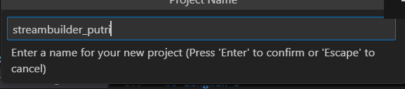
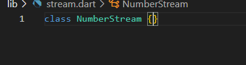
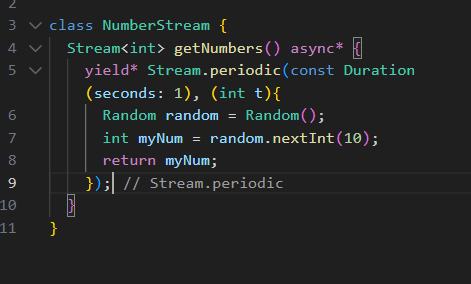
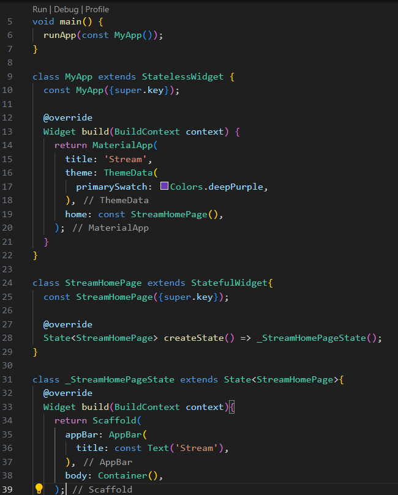
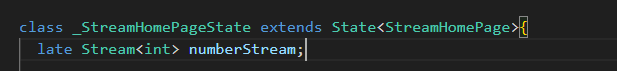
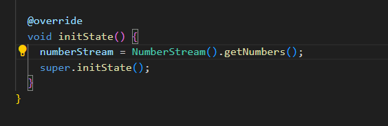
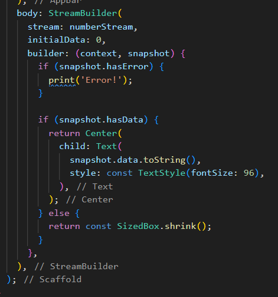

Nama : Putri Ayu Aliciawati  
Kelas : TI-3C  
NIM : 2241720132  

# Praktikum 6  
## Langkah 1  

## Langkah 2

## Langkah 3

## Langkah 4  

## Langkah 5

## Langkah 6

## Langkah 7

## Langkah 8  
### Soal 12
- Jelaskan maksud kode pada langkah 3 dan 7 !  
    Pada langkah 3, kode mendefinisikan kelas `NumberStream` yang memiliki metode `getNumbers()` yang menghasilkan stream angka acak setiap detik. Dengan menggunakan `Stream.periodic`, angka acak antara 0 dan 9 diproduksi setiap detik oleh objek `Random`. Metode ini mengembalikan stream yang dapat didengarkan oleh widget lain untuk mendapatkan data secara periodik. Sementara itu, pada langkah 7, `StreamBuilder` digunakan untuk membangun UI berdasarkan data yang diterima dari stream tersebut. `StreamBuilder` mendengarkan stream yang didefinisikan di langkah 3, dan setiap kali data baru diterima, builder akan dipanggil untuk memperbarui tampilan UI. Jika ada data, angka acak ditampilkan dengan ukuran font besar, dan jika terjadi error, pesan error akan dicetak ke konsol. Jika data belum tersedia, tampilan kosong akan ditampilkan.
- Capture hasil praktikum Anda berupa GIF dan lampirkan di README.  
    
- Lalu lakukan commit dengan pesan "W13: Jawaban Soal 12".