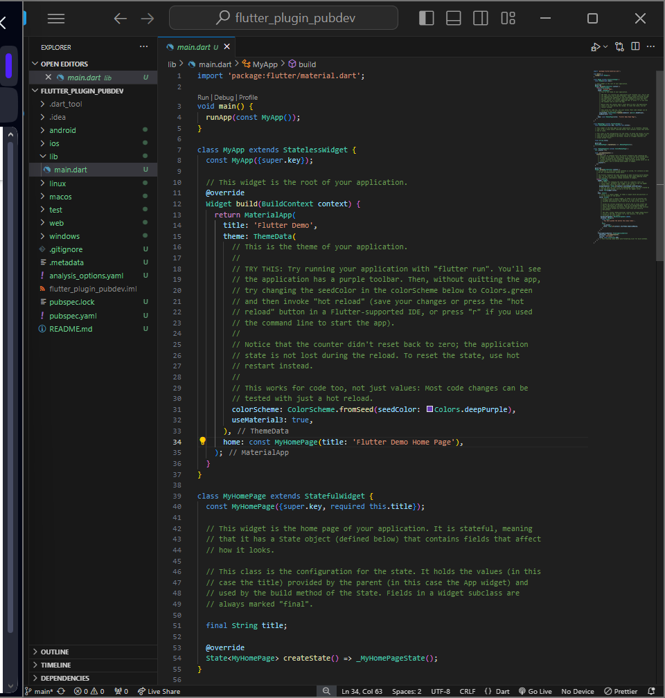
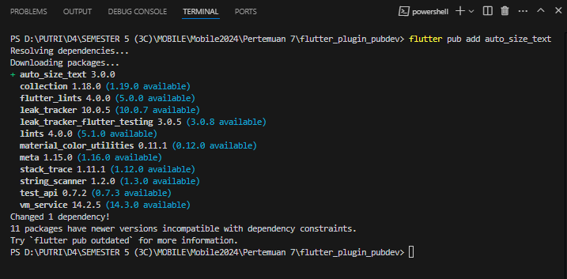
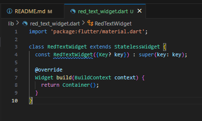
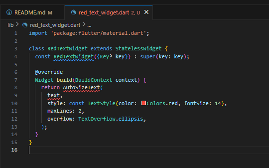
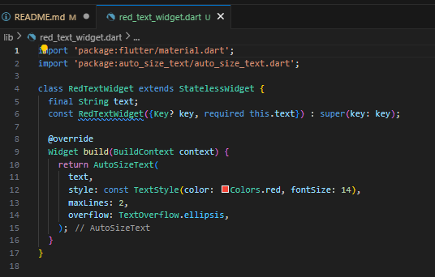

Nama : Putri Ayu Aliciawati  
Kelas : TI-3C  
NIM : 2241720132  

# Praktikum Menerapkan Plugin di Project Flutter  
## Langkah 1  
  
## Langkah 2  
  
## Langkah 3  
  
## Langkah 4  
  
Error terjadi karena AutoSizeText mengharapkan parameter text berupa String, namun variabel text belum didefinisikan dalam kode.  
## Langkah 5  
  
## Langkah 6   
.png)
.png)  

 # Tugas Praktikum  
 2. Jelaskan maksud dari langkah 2 pada Praktikum tersebut!  
 Langkah 2 tersebut menjelaskan cara menambahkan plugin auto_size_text ke dalam proyek Flutter. Plugin auto_size_text digunakan untuk membuat teks yang otomatis menyesuaikan ukurannya agar sesuai dengan ruang yang tersedia.
 Perintah `flutter pub add auto_size_text` adalah perintah yang digunakan di terminal untuk menambahkan plugin auto_size_text secara otomatis ke dalam proyek Flutter. Setelah perintah ini dijalankan, Flutter akan mengunduh dan menambahkan plugin tersebut ke daftar dependencies di file pubspec.yaml.  
 3. Jelaskan maksud dari langkah 5 pada praktikum tersebut!  
Langkah 5 menjelaskan bahwa variabel **`text`** perlu ditambahkan ke dalam kelas **`RedTextWidget`** sebagai parameter, dan variabel tersebut diinisialisasi melalui constructor. Dengan mendeklarasikan **`final String text`**, variabel ini berfungsi untuk menyimpan nilai teks yang akan digunakan oleh widget, dan kata kunci **`final`** menunjukkan bahwa nilainya tidak dapat diubah setelah diinisialisasi. Dalam constructor, **`required this.text`** memastikan bahwa parameter **`text`** harus diberikan setiap kali objek **`RedTextWidget`** dibuat, sehingga nilai teks tersebut dapat digunakan dalam widget. Selain itu, **`super(key: key)`** digunakan untuk memanggil constructor dari kelas induk **`StatelessWidget`**, yang penting untuk pengelolaan widget di dalam Flutter. Langkah ini memungkinkan nilai **`text`** untuk disesuaikan dari luar kelas ketika widget **`RedTextWidget`** digunakan.  
4. Pada langkah 6 terdapat dua widget yang ditambahkan, jelaskan fungsi dan perbedaannya!  
* Widget pertama :  
Fungsi: `Container` ini berfungsi sebagai wadah dengan latar belakang berwarna kuning terang (yellowAccent) dan lebar 50. Di dalamnya terdapat widget RedTextWidget, yang menampilkan teks berwarna merah menggunakan plugin auto_size_text, yang menyesuaikan ukuran teks secara otomatis sesuai ruang yang tersedia dalam wadah.  
Peran `RedTextWidget`: Menampilkan teks dengan gaya khusus yang diatur dalam widget custom, yaitu teks berwarna merah dan otomatis menyesuaikan ukurannya.  
* Widget kedua :  
Fungsi: `Container` ini juga berfungsi sebagai wadah, tetapi dengan latar belakang berwarna hijau terang (greenAccent) dan lebar 100. Di dalamnya terdapat widget Text standar Flutter, yang menampilkan teks secara statis tanpa fitur penyesuaian ukuran otomatis.
Peran `Text`: Menampilkan teks biasa tanpa adanya penyesuaian otomatis pada ukuran teks. Teks ini menggunakan gaya default yang diberikan oleh Flutter tanpa modifikasi khusus.  

Perbedaan antara kedua widget pada langkah 6 terletak pada jenis widget teks dan tampilannya. RedTextWidget adalah widget custom yang secara otomatis menyesuaikan ukuran teks dan menampilkan teks berwarna merah dalam container berwarna kuning dengan lebar 50. Sebaliknya, widget Text adalah widget standar Flutter yang tidak menyesuaikan ukuran teks dan menggunakan gaya default, ditampilkan dalam container berwarna hijau dengan lebar 100.
  
  5. Jelaskan maksud dari tiap parameter yang ada di dalam plugin `auto_size_text` berdasarkan tautan pada dokumentasi ini!  
  Berikut adalah penjelasan singkat mengenai masing-masing parameter dari plugin **AutoSizeText** yang telah disebutkan:
  - **key**: Mengontrol bagaimana satu widget menggantikan widget lain dalam pohon widget. Ini berguna untuk manajemen status dan pemeliharaan identitas widget dalam pohon.
  - **textKey**: Menetapkan kunci untuk widget Text yang dihasilkan, yang juga membantu dalam pengelolaan status.
  - **style**: Jika tidak null, ini menentukan gaya yang digunakan untuk teks, termasuk ukuran font, warna, dan gaya lainnya.
  - **minFontSize**: Batas minimum ukuran teks yang digunakan saat menyesuaikan ukuran teks. Parameter ini diabaikan jika `presetFontSizes` ditetapkan.
  - **maxFontSize**: Batas maksimum ukuran teks yang digunakan saat menyesuaikan ukuran teks. Ini juga diabaikan jika `presetFontSizes` ditetapkan.
  - **stepGranularity**: Ukuran langkah di mana ukuran font disesuaikan dengan batasan yang ada.
  - **presetFontSizes**: Menentukan semua ukuran font yang mungkin. Ukuran-ukuran ini harus dalam urutan menurun agar berfungsi dengan baik.
  - **group**: Mengsinkronkan ukuran beberapa AutoSizeText, sehingga dapat memiliki ukuran yang konsisten.
  - **textAlign**: Menentukan bagaimana teks harus diratakan secara horizontal (misalnya, kiri, tengah, kanan).
  - **textDirection**: Arah teks, memengaruhi bagaimana nilai `textAlign` seperti `TextAlign.start` dan `TextAlign.end` diinterpretasikan.
  - **locale**: Digunakan untuk memilih font saat karakter Unicode yang sama dapat dirender dengan cara yang berbeda tergantung pada lokal.
  - **softWrap**: Menentukan apakah teks harus terputus pada garis putus.
  - **wrapWords**: Menentukan apakah kata-kata yang tidak muat dalam satu baris harus dibungkus. Secara default, ini diatur ke true, berperilaku seperti widget Text biasa.
  - **overflow**: Menentukan bagaimana kelebihan visual harus ditangani jika teks melampaui batasnya.
  - **overflowReplacement**: Jika teks meluap dan tidak muat dalam batas, widget ini akan ditampilkan sebagai pengganti.
  - **textScaleFactor**: Mengukur jumlah piksel font untuk setiap piksel logis, juga memengaruhi `minFontSize`, `maxFontSize`, dan `presetFontSizes`.
  - **maxLines**: Jumlah maksimum baris opsional yang dapat dilalui teks.
  - **semanticsLabel**: Label semantik alternatif untuk teks ini, berguna untuk aksesibilitas.
