Nama : Putri Ayu Aliciawati  
Kelas : TI-3C  
NIM : 2241720132  

# Dasar State Management  
## Praktikum 1: Dasar State dengan Model-View
### Langkah 1
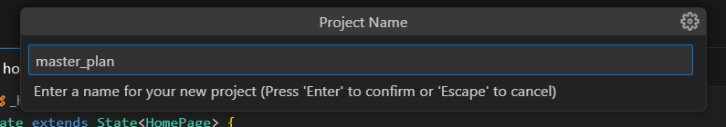  
.png)
### Langkah 2  
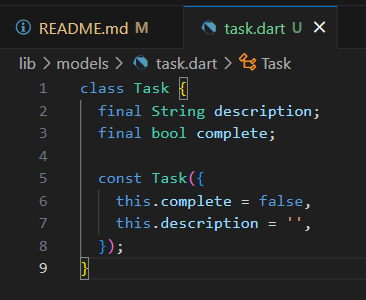  
### Langkah 3  
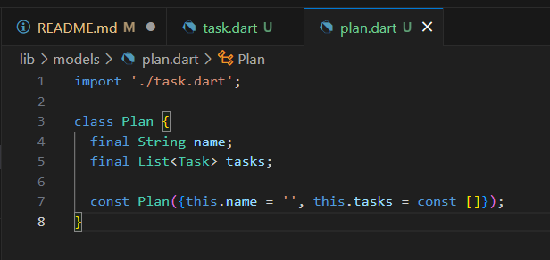  
### Langkah 4  
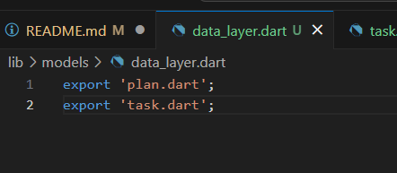  
### Langkah 5  
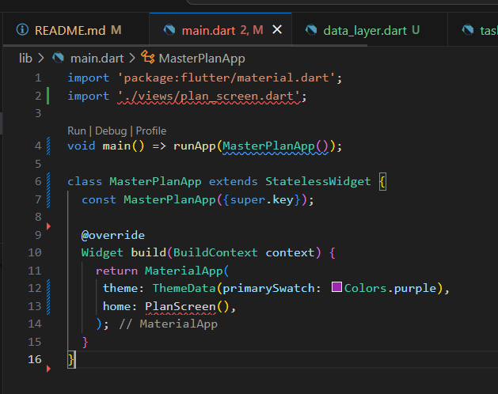  
### Langkah 6  
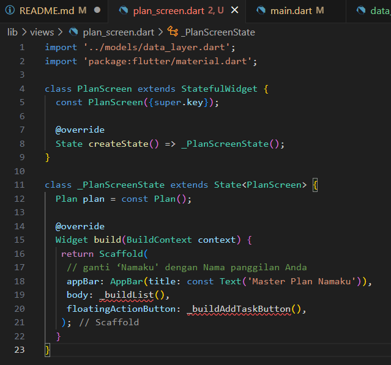  
### Langkah 7  
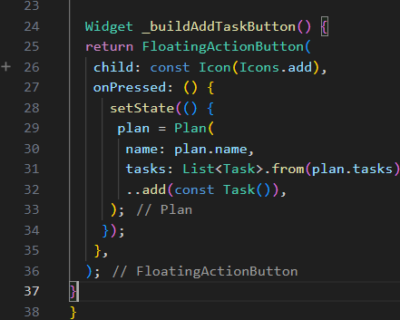  
### Langkah 8  
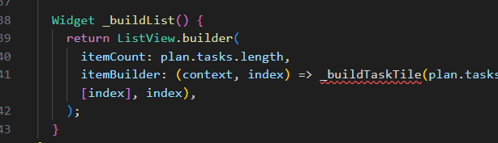  
### Langkah 9  
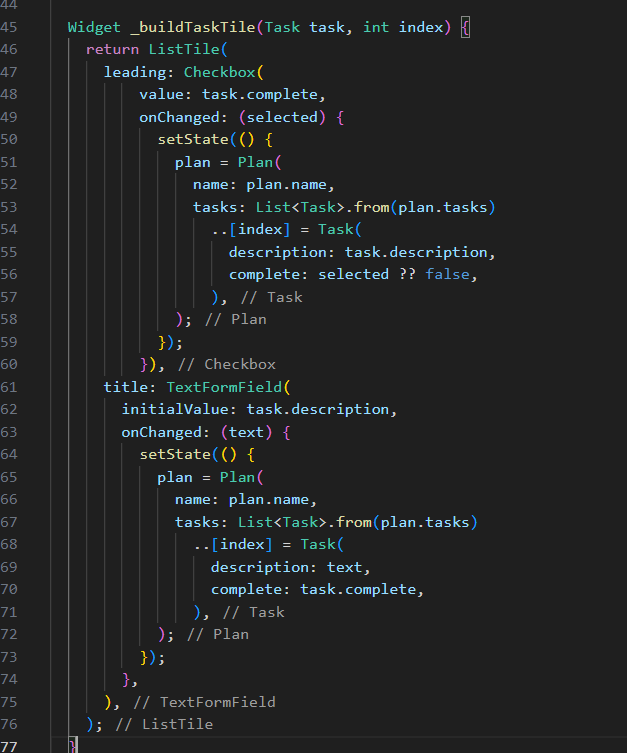  
### Langkah 10  
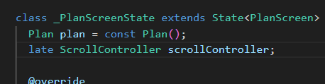  
### Langkah 11  
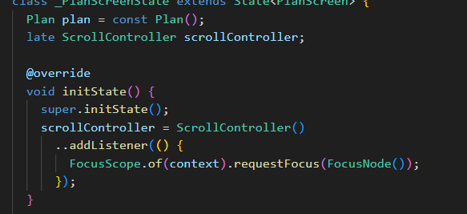  
### Langkah 12  
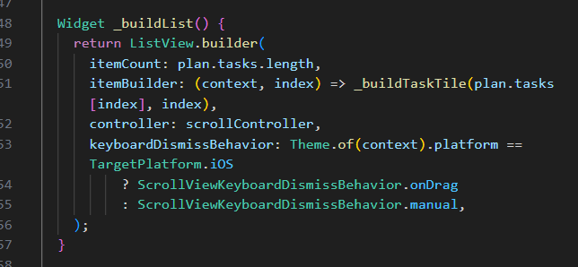  
### Langkah 13  
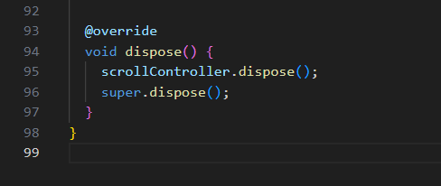  
### Langkah 14  

.jpg)  

## Tugas Praktikum 1  
2. Jelaskan maksud dari langkah 4 pada praktikum tersebut! Mengapa dilakukan demikian?  
Langkah 4 menggunakan perintah `export` untuk menggabungkan file `plan.dart` dan `task.dart` dalam satu titik akses, sehingga memudahkan impor di bagian lain dari proyek. Ini dilakukan untuk menyederhanakan struktur kode, mengurangi duplikasi impor, dan mempermudah pengelolaan file yang sering digunakan bersama, sehingga cukup mengimpor satu file untuk mengakses keduanya.
3. Mengapa perlu variabel plan di langkah 6 pada praktikum tersebut? Mengapa dibuat konstanta ?  
Variabel plan digunakan untuk menyimpan data rencana yang akan ditampilkan di PlanScreen, dan dibuat sebagai konstanta (const) untuk menghemat memori jika data tersebut tidak berubah, memungkinkan Dart mengoptimalkan penggunaan memori.
4. Lakukan capture hasil dari Langkah 9 berupa GIF, kemudian jelaskan apa yang telah Anda buat!
Fungsi `_buildTaskTile` membuat tampilan untuk setiap tugas dalam bentuk `ListTile` yang berisi `Checkbox` dan `TextFormField`. `Checkbox` menandai apakah tugas selesai atau belum, dan `TextFormField` mengedit deskripsi tugas. Setiap kali nilai `Checkbox` atau teks berubah, metode `setState` dipanggil untuk memperbarui `plan` dengan membuat salinan baru dari daftar tugas, sehingga perubahan langsung terlihat di UI.  

5. Apa kegunaan method pada Langkah 11 dan 13 dalam lifecyle state ?  
Pada langkah 11, `initState` digunakan untuk menginisialisasi `scrollController` dan menambahkan listener yang menyembunyikan keyboard saat menggulir. Pada langkah 13, `dispose` digunakan untuk membebaskan sumber daya yang digunakan oleh `scrollController`, mencegah kebocoran memori saat objek state dihapus.
