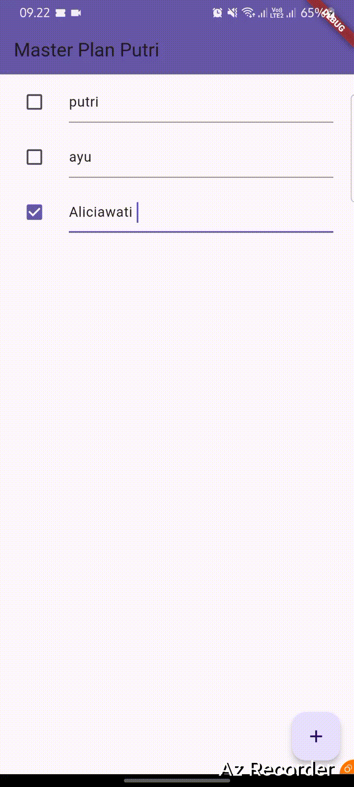
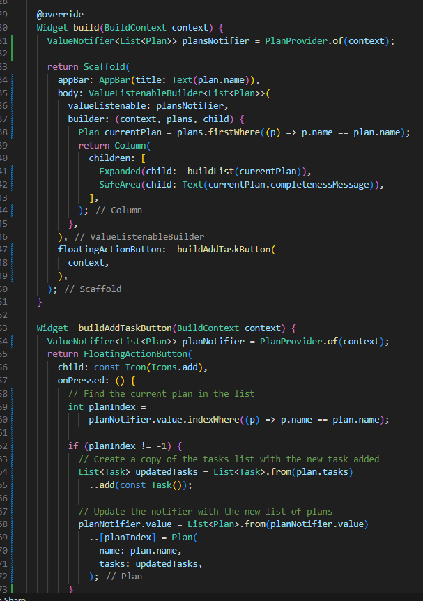
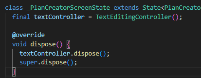
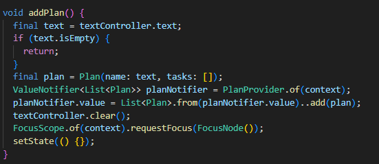

Nama : Putri Ayu Aliciawati  
Kelas : TI-3C  
NIM : 2241720132  

# Dasar State Management  
## Praktikum 1: Dasar State dengan Model-View
### Langkah 1
  
.png)
### Langkah 2  
  
### Langkah 3  
  
### Langkah 4  
  
### Langkah 5  
  
### Langkah 6  
  
### Langkah 7  
  
### Langkah 8  
  
### Langkah 9  
  
### Langkah 10  
  
### Langkah 11  
  
### Langkah 12  
  
### Langkah 13  
  
### Langkah 14  

.jpg)  

## Tugas Praktikum 1  
2. Jelaskan maksud dari langkah 4 pada praktikum tersebut! Mengapa dilakukan demikian?  
Langkah 4 menggunakan perintah `export` untuk menggabungkan file `plan.dart` dan `task.dart` dalam satu titik akses, sehingga memudahkan impor di bagian lain dari proyek. Ini dilakukan untuk menyederhanakan struktur kode, mengurangi duplikasi impor, dan mempermudah pengelolaan file yang sering digunakan bersama, sehingga cukup mengimpor satu file untuk mengakses keduanya.
3. Mengapa perlu variabel plan di langkah 6 pada praktikum tersebut? Mengapa dibuat konstanta ?  
Variabel plan digunakan untuk menyimpan data rencana yang akan ditampilkan di PlanScreen, dan dibuat sebagai konstanta (const) untuk menghemat memori jika data tersebut tidak berubah, memungkinkan Dart mengoptimalkan penggunaan memori.
4. Lakukan capture hasil dari Langkah 9 berupa GIF, kemudian jelaskan apa yang telah Anda buat!
Fungsi `_buildTaskTile` membuat tampilan untuk setiap tugas dalam bentuk `ListTile` yang berisi `Checkbox` dan `TextFormField`. `Checkbox` menandai apakah tugas selesai atau belum, dan `TextFormField` mengedit deskripsi tugas. Setiap kali nilai `Checkbox` atau teks berubah, metode `setState` dipanggil untuk memperbarui `plan` dengan membuat salinan baru dari daftar tugas, sehingga perubahan langsung terlihat di UI.  

5. Apa kegunaan method pada Langkah 11 dan 13 dalam lifecyle state ?  
Pada langkah 11, `initState` digunakan untuk menginisialisasi `scrollController` dan menambahkan listener yang menyembunyikan keyboard saat menggulir. Pada langkah 13, `dispose` digunakan untuk membebaskan sumber daya yang digunakan oleh `scrollController`, mencegah kebocoran memori saat objek state dihapus.

## Praktikum 2: Mengelola Data Layer dengan InheritedWidget dan InheritedNotifier
### Langkah 1
  
### Langkah 2  
  
### Langkah 3  
  
### Langkah 4
  
### Langkah 5 
  
### Langkah 6  
  
### Langkah 7  
  
### Langkah 8 dan 9  
  

## Tugas Praktikum 2  
1. Selesaikan langkah-langkah praktikum tersebut, lalu dokumentasikan berupa GIF hasil akhir praktikum beserta penjelasannya di file README.md! Jika Anda menemukan ada yang error atau tidak berjalan dengan baik, silakan diperbaiki sesuai dengan tujuan aplikasi tersebut dibuat.

2. Jelaskan mana yang dimaksud InheritedWidget pada langkah 1 tersebut! Mengapa yang digunakan InheritedNotifier?  
Pada langkah 1, InheritedWidget yang dimaksud adalah kelas PlanProvider. Pada langkah 1, PlanProvider adalah subclass dari InheritedNotifier, yang memungkinkan data dibagikan di seluruh widget tree dan memberikan notifikasi otomatis saat data berubah. Penggunaan InheritedNotifier memungkinkan widget yang bergantung pada PlanProvider untuk mendapatkan pembaruan secara otomatis ketika objek Plan berubah, meningkatkan efisiensi dan mempermudah pengelolaan status dalam aplikasi Flutter.  
3. Jelaskan maksud dari method di langkah 3 pada praktikum tersebut! Mengapa dilakukan demikian?  
Pada langkah 3, `completedCount` menghitung jumlah tugas yang telah diselesaikan dengan memfilter daftar `tasks`, sementara `completenessMessage` mengembalikan string yang menunjukkan berapa banyak tugas yang selesai dari total tugas. Keduanya memudahkan akses informasi mengenai status penyelesaian tugas, meningkatkan keterbacaan kode, dan memberikan umpan balik langsung kepada pengguna.
4. Lakukan capture hasil dari Langkah 9 berupa GIF, kemudian jelaskan apa yang telah Anda buat!  
  
Kode yang telah dibuat adalah implementasi dari `PlanScreen`, sebuah layar dalam aplikasi Flutter untuk mengelola daftar tugas. Ini menggunakan `StatefulWidget` dengan `ScrollController` untuk mengelola perilaku gulir. Dalam `build`, `ValueListenableBuilder` digunakan untuk mendengarkan perubahan pada objek `Plan`, menampilkan daftar tugas dalam `ListView`. Terdapat tombol untuk menambahkan tugas baru dan widget `ListTile` untuk setiap tugas yang memungkinkan pengguna menandai tugas sebagai selesai atau mengedit deskripsi. Metode `dispose` digunakan untuk membersihkan `scrollController` saat widget dihapus, mencegah kebocoran memori.  

## Praktikum 3
### Langkah 1
  
### Langkah 2
  
.png)
### Langkah 3
  
### Langkah 4
Itu akan terjadi error setiap kali memanggil PlanProvider.of(context). Itu terjadi karena screen saat ini hanya menerima tugas-tugas untuk satu kelompok Plan, tapi sekarang PlanProvider menjadi list dari objek plan tersebut.
### Langkah 5

### Langkah 6

### Langakh 7
  
### Langkah 8

### Langkah 9  

### Langkah 10
  
### Langkah 11

### Langkah 12

### Langkah 13

### Langkah 14
  
.gif)

## Tugas Praktikum 3
1. Selesaikan langkah-langkah praktikum tersebut, lalu dokumentasikan berupa GIF hasil akhir praktikum beserta penjelasannya di file README.md! Jika Anda menemukan ada yang error atau tidak berjalan dengan baik, silakan diperbaiki sesuai dengan tujuan aplikasi tersebut dibuat.  
.gif)  
2. Berdasarkan Praktikum 3 yang telah Anda lakukan, jelaskan maksud dari gambar diagram berikut ini!  
Gambar diagram tersebut menunjukkan alur navigasi dan struktur hierarki widget dalam aplikasi Flutter yang melibatkan dua layar utama: `PlanCreatorScreen` dan `PlanScreen`.

a. **Bagian Kiri - `PlanCreatorScreen`**: 
   - Struktur ini dimulai dari `MaterialApp`, yang menjadi root aplikasi Flutter.
   - `PlanProvider` adalah widget yang menyediakan data untuk widget di bawahnya, termasuk `PlanCreatorScreen`.
   - `PlanCreatorScreen` menggunakan widget `Column` yang berisi `TextField` dan `Expanded`.
   - Di dalam `Expanded`, terdapat `ListView`, yang digunakan untuk menampilkan daftar item atau komponen yang bisa di-scroll.

b. **Navigasi `Navigator Push`**:
   - `Navigator Push` menunjukkan transisi dari layar `PlanCreatorScreen` ke layar `PlanScreen` ketika pengguna berinteraksi dengan tombol atau aksi tertentu.
   - Ini adalah fungsi navigasi yang memungkinkan pengguna berpindah layar dalam aplikasi.

c. **Bagian Kanan - `PlanScreen`**:
   - Sama seperti `PlanCreatorScreen`, layar ini diawali dengan `MaterialApp` dan `PlanProvider`.
   - `PlanScreen` menggunakan widget `Scaffold` untuk memberikan struktur dasar layar, seperti app bar dan body.
   - `Column` di dalamnya mengatur tata letak `Expanded` dan `SafeArea`.
   - `Expanded` berisi `ListView`, dan `SafeArea` berisi `Text`, yang kemungkinan digunakan untuk menampilkan informasi atau status.

Diagram ini menggambarkan alur navigasi dan struktur dari dua layar dalam aplikasi Flutter. `PlanCreatorScreen` adalah layar pertama untuk membuat rencana, sedangkan `PlanScreen` adalah layar kedua yang menampilkan detail rencana. Navigasi dilakukan menggunakan `Navigator Push`, yang memungkinkan perpindahan antara kedua layar ini.  

3. Lakukan capture hasil dari Langkah 14 berupa GIF, kemudian jelaskan apa yang telah Anda buat!  
.gif)  
Fungsi `_buildMasterPlans()` menampilkan daftar rencana (plans) dalam aplikasi Flutter. Jika daftar rencana kosong, ditampilkan pesan "Anda belum memiliki rencana apapun" bersama ikon, menunjukkan bahwa pengguna belum membuat rencana. Namun, jika terdapat rencana, daftar ditampilkan dalam bentuk `ListView` dengan setiap rencana sebagai `ListTile` yang memuat nama dan status kelengkapan rencana. Ketika pengguna memilih salah satu rencana, aplikasi akan berpindah ke layar `PlanScreen` yang menampilkan detail dari rencana tersebut.